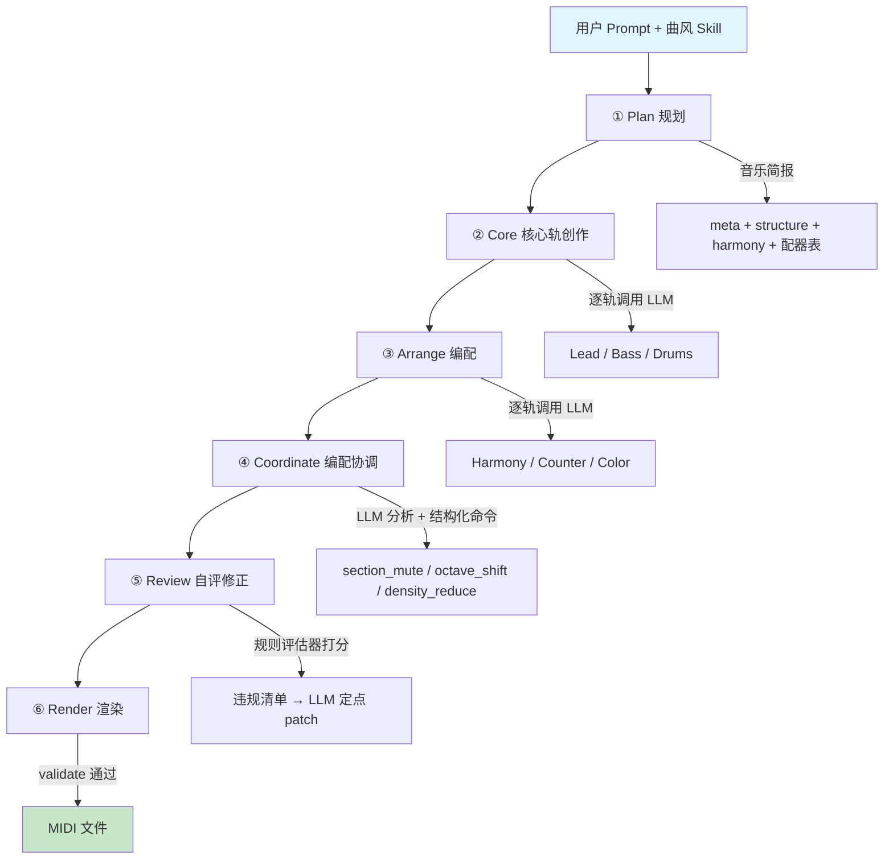

<table width="100%">
  <tr>
    <td align="left" width="120">
      
    </td>
    <td align="right">
      <h1>MiiDi</h1>
      <h3 style="margin-top: -10px;">AI 原生 MIDI 音乐生成评估平台</h3>
    </td>
  </tr>
</table>

一句自然语言描述，加一个风格包，产出可以直接在 DAW 里编辑的多轨 MIDI。五阶段流水线负责生成，双轨评估器负责质检——规则违规会回流到生成端做定点修补，评过的分数决定下一轮怎么改。

## 功能

- **自然语言作曲**：五种风格（流行、古典、爵士、Lo-Fi、东方 Project），每种风格有独立知识包约束 LLM 的音乐语言
- **双轨评估**：确定性规则轴 + LLM Judge 三维打分，合成一个 composite 分数，附反退化门防作弊
- **分阶段生成**：每个阶段落盘一个版本快照，支持断点续跑、单轨修改、版本回滚
- **复古桌面 UI**：System 6 风格多窗口界面，钢琴卷帘预览、会话恢复、版本历史

## 快速开始

### 1. 安装

```bash
pip install -e ".[dev]"
```

### 2. 配置 LLM

**方式 A：OpenCode Zen（免费）**

```bash
# 零配置直接跑，默认模型 hy3-free
python -m miidi generate --prompt "雨夜的咖啡馆" --style lofi

# 换 Zen 目录下的其他模型
MODEL_NAME=deepseek-v4-flash-free python -m miidi generate --prompt "雨夜的咖啡馆" --style lofi
```

**方式 B：OpenAI 兼容 API**

```bash
cp env.example .env
# 编辑 .env：OPENAI_BASE_URL / OPENAI_API_KEY / MODEL_NAME
```

### 3. 生成音乐

```bash
# 查看可用曲风
python -m miidi styles

# 全流程生成
python -m miidi generate --style lofi --prompt "雨夜的咖啡馆" --out output/

# 分阶段生成，可中断续跑
python -m miidi generate --style jazz --prompt "深夜即兴" --stages plan
python -m miidi generate --style jazz --prompt "深夜即兴" --stages plan,core
python -m miidi generate --style jazz --prompt "深夜即兴" --stages plan,core,arrange

# 评估生成结果
python -m miidi evaluate --json output/path/to/composition.json
```

### 4. 启动 Web 应用

```bash
python src/miidi/serve.py
```

浏览器打开 `http://localhost:8000`。

## 架构概览



| 模块 | 职责 | 关键文件 |
|------|------|----------|
| **schema** | 数据模型、格式修复、硬约束校验 | `model.py` / `normalize.py` |
| **eval** | 规则评估轴、反退化门、LLM Judge、合成评分 | `axes/` / `gates.py` / `score.py` |
| **llm** | LLM 客户端，双协议自动降级 | `client.py` |
| **skills** | 曲风知识包加载器 | `loader.py` |
| **pipeline** | 五阶段流水线、编配协调、会话式修改 | `stages.py` / `orchestrator.py` |
| **session** | 版本管理、快照持久化 | `store.py` |
| **render** | MIDI 渲染 | `midi.py` |
| **web** | FastAPI 应用、RESTful API | `app.py` / `routes.py` |

技术栈：Python ≥3.11、pydantic v2、FastAPI、uvicorn、httpx；前端 Vite + vanilla JS + @sakun/system.css；MIDI 渲染用 midiutil。

## 运行评测

评测脚本走真实 LLM，不属于测试套件：

```bash
# 全量评测（38 样本：5 风格基础 ×20 + 约束 ×8 + 高难 ×6 + 对抗 ×4）
python -m evals.runners.run_eval --samples evals/samples --out evals/results --workers 4

# 汇总统计（按风格 / 类别 / 分数段 / 规则轴）
python -m evals.runners.summarize --results evals/results

# 有效性验证实验（E1 区分度 / E2 确定性 / E3 对抗性）
python -m evals.experiments.run_experiments \
    --composition evals/results/base_composition.json --style classical --out evals/results
```

结果表与逐样本原始产物在 [evals/results/](evals/results/results.md)，一轮完整评测的实测耗时见[实验报告](docs/report.md#4-评测实施)。

## 文档

| 文档 | 内容 |
|------|------|
| [architecture.md](docs/architecture.md) | 模块依赖、数据契约、设计取舍 |
| [pipeline.md](docs/pipeline.md) | 五阶段流水线详解、分阶段与续跑语义 |
| [evaluation.md](docs/evaluation.md) | 双轨评测方法：六轴、四道门、三维 Judge |
| [styles.md](docs/styles.md) | 曲风知识包结构、与评估的关系、扩展方法 |
| [api.md](docs/api.md) | HTTP 接口、续跑语义、错误码 |
| [report.md](docs/report.md) | 实验报告：场景选择、评测数据、失败模式分析 |

## 许可证

[MIT](LICENSE)
