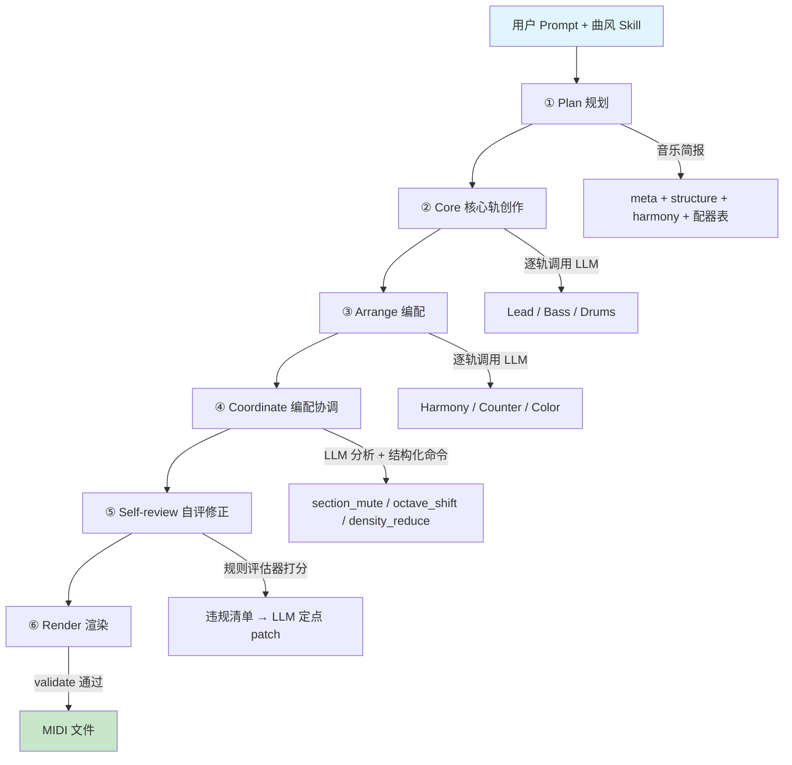

<table width="100%">
  <tr>
    <td align="left" width="120">
      
    </td>
    <td align="right">
      <h1>MiiDi</h1>
      <h3 style="margin-top: -10px;">AI 原生 MIDI 音乐生成评估平台</h3>
    </td>
  </tr>
</table>

---

## 功能亮点

- **自然语言创作**：用文字描述音乐意图，LLM 自动完成从简报到音符的全流程生成
- **五种曲风**：流行、古典、爵士、Lo-Fi、东方 Project，每种风格配备独立知识包
- **智能自评**：内置规则评估器 + LLM Judge 双轨评分，生成后自动检测并修正问题
- **编配协调**：独立的编配协调器分析频谱平衡、段落密度、角色清晰度，输出结构化调整命令
- **分阶段生成**：Plan → Core → Arrange → Coordinate → Review 五阶段，支持断点续跑、单轨修改、版本回滚
- **多 LLM 后端**：OpenCode Zen 免费模型 / 自定义 OpenAI 兼容 API
- **可编辑 MIDI**：输出标准 MIDI 文件，可在任意 DAW 中打开、修改、再创作
- **复古桌面 UI**：System 6 风格多窗口界面，极简而功能完整

---

## 快速开始

### 1. 安装依赖

```bash
pip install -e ".[dev]"
```

### 2. 配置 LLM

**方式 A：OpenCode Zen（免费，无需 API Key）**

```bash
# 直接使用，无需配置任何环境变量
python -m miidi generate --prompt "雨夜的咖啡馆" --style lofi

# 指定模型
MODEL_NAME=hy3-free python -m miidi generate --prompt "雨夜的咖啡馆" --style lofi
```

**方式 B：自定义 OpenAI 兼容 API**

```bash
cp env.example .env
# 编辑 .env：
OPENAI_BASE_URL=https://your-api-endpoint
OPENAI_API_KEY=your-key
MODEL_NAME=your-model
```

### 3. 运行测试

```bash
python -m pytest tests/ -v
```

### 4. 生成音乐

```bash
# 查看可用曲风
python -m miidi styles

# 全流程生成
python -m miidi generate --style lofi --prompt "雨夜的咖啡馆" --out output/

# 分阶段生成（可中断续跑）
python -m miidi generate --style jazz --prompt "深夜即兴" --stages plan       # 仅生成简报
python -m miidi generate --style jazz --prompt "深夜即兴" --stages plan,core   # 生成旋律/贝斯/鼓
python -m miidi generate --style jazz --prompt "深夜即兴" --stages plan,core,arrange  # 含编配
python -m miidi generate --style jazz --prompt "深夜即兴"                       # 全流程（含协调+自评）

# 评估生成结果
python -m miidi evaluate --json output/path/to/composition.json
```

### 5. 启动 Web 应用

```bash
# 一键启动
python serve.py
```

浏览器访问 `http://localhost:8000`，通过复古桌面界面进行可视化创作。

---

## 架构概览



### 核心模块

| 模块 | 职责 | 关键文件 |
|------|------|----------|
| **schema** | 数据模型定义、格式修复、硬约束校验 | `model.py` / `normalize.py` |
| **eval** | 规则评估轴实现、聚合评分、反退化门 | `axes/` / `gates.py` / `score.py` |
| **render** | MIDI 渲染 | `midi.py` |
| **llm** | LLM 客户端（Responses API + Chat Completions + Zen 自动降级） | `client.py` |
| **skills** | 曲风知识包加载器 | `loader.py` |
| **pipeline** | 五阶段流水线、编配协调、会话式修改 | `stages.py` / `orchestrator.py` / `prompts.py` |
| **session** | 版本管理、快照持久化 | `store.py` |
| **web** | FastAPI 应用、RESTful API | `web/` |

### 前端架构

| 窗口 | 功能 |
|------|------|
| **Intro** | 欢迎页面，点击 "Get Started" 进入创作 |
| **Composer** | Prompt 输入、曲风选择、生成进度 |
| **Piano Roll** | 多轨音符网格渲染、播放控制 |
| **Evaluator** | 各轴分数条形图、违规明细、编配调整、自评轨迹 |
| **Feedback** | 自然语言反馈、版本历史、回滚 |

顶部流程指示条显示当前阶段（Intro → Compose → Preview → Evaluate → Revise），支持向后导航。

---

## 分阶段生成

流水线分为五个阶段，每个阶段完成后保存一个版本快照：

| 阶段 | 内容 | 耗时（参考） |
|------|------|-------------|
| **Plan** | 音乐简报：调性、节奏、和声、结构、配器 | ~10s |
| **Core** | 核心轨：旋律、贝斯、鼓 | ~6min |
| **Arrange** | 编配轨：和声、对位、色彩 | ~8min |
| **Coordinate** | 编配协调：LLM 分析整体平衡，输出 section_mute / octave_shift / density_reduce 调整命令 | ~1min |
| **Review** | 自评修正：规则评估 → LLM 定点 patch | ~1min |

支持：
- 断点续跑：指定 `--stages` 从指定阶段开始
- 单轨修改：`POST /sessions/{sid}/revise` 针对单个轨道修改
- 版本回滚：`POST /sessions/{sid}/versions/{v}/rollback`

---

## 技术栈

| 层 | 技术 |
|---|------|
| **后端** | Python ≥3.11、pydantic v2、FastAPI、uvicorn、httpx |
| **前端** | Vite、JavaScript、@sakun/system.css（System 6 风格） |
| **音频** | midiutil |
| **评测** | numpy、scipy、pandas、pytest |

---

## 评测体系

### 双轨架构

```
Composition JSON ──┬─ 规则轨：六个确定性轴 → 加权和 → 反退化门 → R_rule ∈ [0,100]
                   │    （可复现、零 API 成本、无法靠话术骗分）
                   └─ Judge 轨：LLM-as-judge ×3 维
                        （覆盖规则无法触及的风格与美学维度）
```

### 规则轨六轴

| 轴 | 权重 | 检测内容 |
|----|------|----------|
| **A1 格式规范性** | 资格门 | validate 通过性、音符越界、轨内重叠 |
| **A2 和声正确性** | 0.30 | 音阶符合度、和弦支撑度、终止式存在性 |
| **A3 声部写作质量** | 0.20 | 音域适配、平行五八度、跳进控制 |
| **A4 节奏律动** | 0.20 | 网格吸附率、密度梯度、鼓 pattern 匹配 |
| **A5 结构与发展性** | 0.20 | 段落覆盖、相似度矩阵、动机再现 |
| **A6 动态表现力** | 0.10 | velocity 分布、段落梯度 |

### 反退化门（乘法）

| 门 | 防御目标 |
|----|----------|
| G_repetition | 反「复读凑篇幅」 |
| G_density | 反「十六分轰炸刷复杂度」 |
| G_balance | 反「凑轨数」 |
| G_spread | 反「表面丰富」 |

### Judge 轨三维

- **J1 风格符合度**：逐条对照曲风特征清单，yes/partial/no 判定
- **J2 提示遵循度**：显式约束精确核对 + 意象类三值判定
- **J3 整体音乐性**：1-5 分锚点 rubric，每档附可查特征

**合成分**：`composite = 0.6 * R_rule + 0.4 * mean(J1, J2, J3)`

---

## API 端点

| 方法 | 路径 | 说明 |
|------|------|------|
| POST | `/api/sessions` | 创建会话（仅 Plan 阶段） |
| POST | `/api/sessions/{sid}/generate` | 执行指定阶段 |
| GET | `/api/sessions/{sid}/status` | 查看会话状态 |
| GET | `/api/sessions/{sid}/composition` | 获取当前版本曲谱 |
| GET | `/api/sessions/{sid}/versions` | 版本历史 |
| POST | `/api/sessions/{sid}/revise` | 单轨/全曲修改 |
| POST | `/api/sessions/{sid}/versions/{v}/rollback` | 回滚到指定版本 |
| POST | `/api/sessions/{sid}/evaluate` | 规则评估 |
| GET | `/api/sessions/{sid}/midi` | 下载 MIDI 文件 |

---

## 许可证

[MIT](LICENSE)
